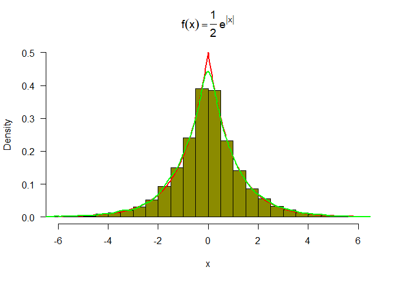
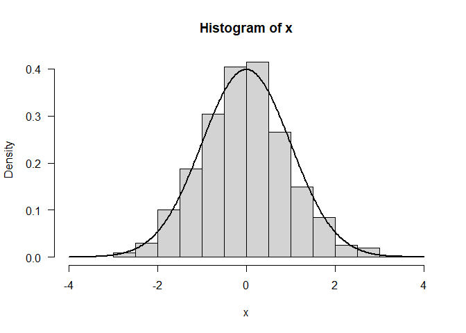
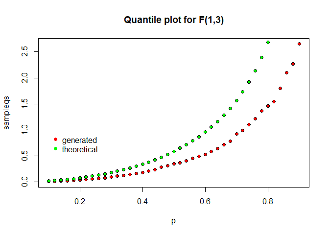
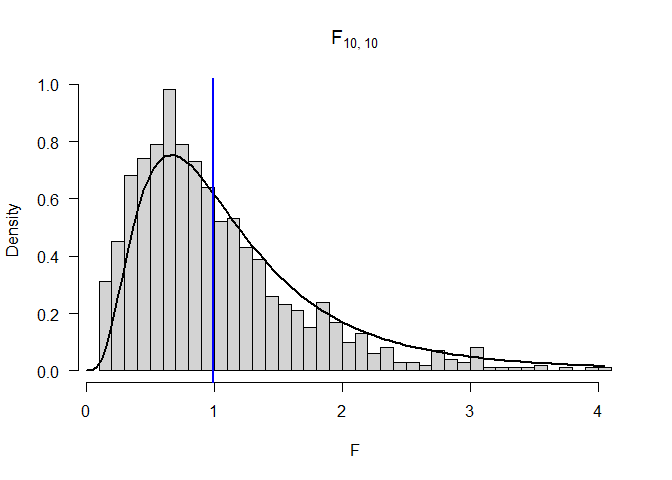
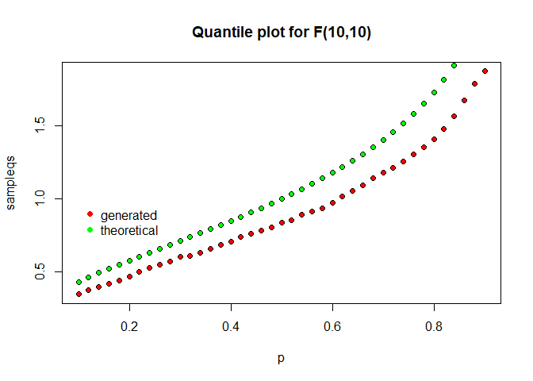
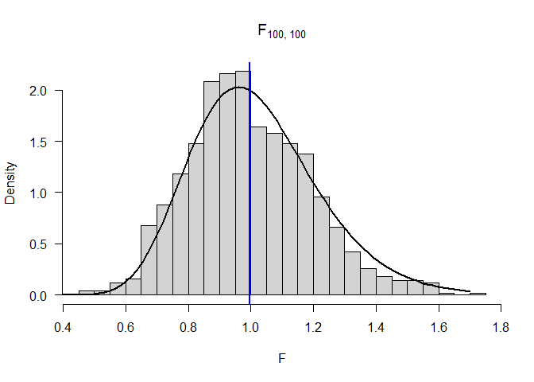
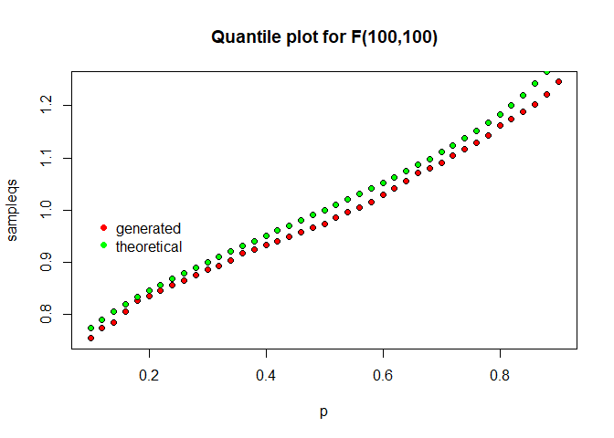
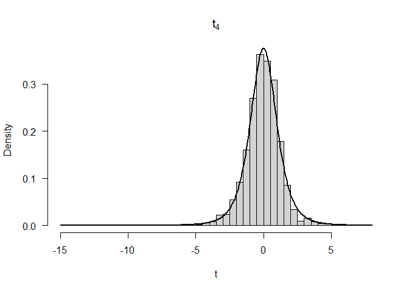
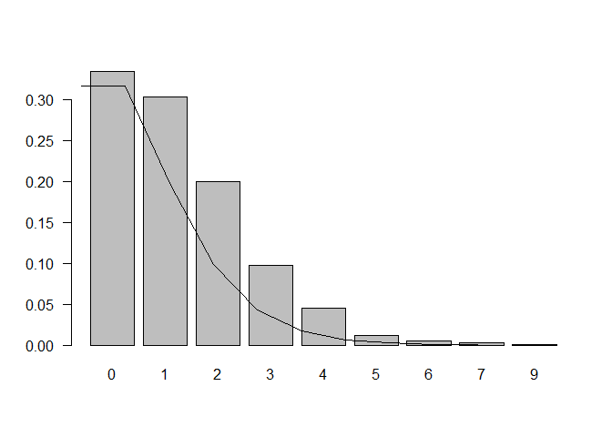

Generating U(a,b) from U(0,1)


```r
U <- function(n, a, b){
  a + (b-a)*runif(n);
}
print(U(10, 2, 6))
```

```
##  [1] 5.050647 4.574167 4.034008 4.312527 2.963141 3.804095 4.231336 2.411490
##  [9] 2.893897 5.739420
```
Simulation checks

```r
a = 4; b = 10;
# prob = T switches y-axis to density
# las = 1 sets the y-axis values vertically
hist(runif(1000, a, b), prob = T, col = "turquoise3", las = 1)
hist(U(1000, a, b), prob = T, col = "green4", las = 1)
```


## Inverse transform method

Use the fact that the cdf of $F_x(x)$ is the same as the cdf of $U(0,1)$, i.e 
$F_x(x) \sim U(0,1)$
if $F_x(x)$ is invertible and we can derive the formula analytically, then we 
can generate random variables using

1. Generate $U \sim U(0,1)$
2. Set $X = F^{-1}_x(u)$

More generally, $F^{-1}_x(u) = \inf_x\{F_x(x)=u\}$

Example: Generate exponentially distributed random variables
$X \sim exp(\lambda)$
pdf: $f(x) = \lambda e^{-\lambda x }$ with $x \in (0, \infty)$
A quick calculation shows
cdf: $F_x(x) = 1 - e^{-\lambda x}$
quantile: $F_x^{-1}(x) = -\ln(1-x)/\lambda$

```r
lambda = 2
u = runif(1000)
x = -log(u)/lambda

hist(x, prob = T, las = 1, col="seagreen4",breaks =20,
     main = latex2exp::TeX('$f(x) = \\lambda e^{-\\lambda x }$'))
y = seq(0,4, .01)
lines(y, lambda*exp(-lambda*y), lwd = 2)
```

<!-- -->

$X$ is standard double-exponential distributed i.e
$f(x) = \frac{1}{2}e^{|x|}$
One gets $F_X(x) = \frac{1}{2}e^{x}$ if $x \leq 0$ 

and $F_X(x) = 1-\frac{1}{2}e^{-x}$ if $x>0$

Therefore, $F_X^{-1}(p) = \log(2p)$ if $p\leq 0.5$

and $F_X^{-1}(p) = -\log(2(1-p))$ if $p>0.5$

```r
coolerQ <- function(p){
  return(ifelse(p<=0.5, log(2*p), -log(2*(1-p))))
}
n=10000;
u = runif(n);
x = coolerQ(u);
hist(x, prob = T, las = 1, col="yellow4", breaks = 60,
     main = latex2exp::TeX('$f(x) = \\frac{1}{2}e^{|x|}$'),ylim=c(0,0.5), xlim=c(-6,6))
y = seq(-6,6,.02);
lines(y, 0.5*exp(-abs(y)),lwd = 2, col="red")
d <- density(x);
lines(d, lwd =2, col="green")
```

<!-- -->

Comparison between empirical and theoretical quantiles


```r
p = seq(0.1, 0.9, by = 0.1)
sampleqs = quantile(x,p);
theoryqs = coolerQ(p);
se = sqrt(p*(1-p)/(n*(1/2*exp(-abs(theoryqs)))^2));
devs = round(cbind((sampleqs-theoryqs)/se),2);
df <- data.frame(p,sampleqs,theoryqs,se, devs)
print(df)
```

```
##       p     sampleqs   theoryqs         se  devs
## 10% 0.1 -1.619784223 -1.6094379 0.03000000 -0.34
## 20% 0.2 -0.896123380 -0.9162907 0.02000000  1.01
## 30% 0.3 -0.507413386 -0.5108256 0.01527525  0.22
## 40% 0.4 -0.221039139 -0.2231436 0.01224745  0.17
## 50% 0.5 -0.004845036  0.0000000 0.01000000 -0.48
## 60% 0.6  0.212678527  0.2231436 0.01224745 -0.85
## 70% 0.7  0.487125079  0.5108256 0.01527525 -1.55
## 80% 0.8  0.884474927  0.9162907 0.02000000 -1.59
## 90% 0.9  1.599478795  1.6094379 0.03000000 -0.33
```


## Acceptance-Rejection Method

Example: Generate $X \sim N(0,1)$ using Student t distribution with 2 degrees
of freedom:

$g(x) = \frac{\Gamma(3/2)}{\sqrt{2\pi}}(1+x^2/2)^{-3/2}$

$f(x) = \frac{1}{\sqrt{2\pi}}e^{-x^2/2}$
Find a maximal constant $c$ such that $\frac{f(x)}{g(x)}\leq c$ for all $x$.
After rather long calculation one finds

$c = \frac{(3/2)^{3/2}}{\Gamma(3/2)e^{1/2}} \approx 1.25731677$

The Algorithm:

1. Generate $Y \sim g$
2. Generate $U \sim U(0,1)$
3. if $U \leq \frac{f(Y)}{cg(Y)}$ then accept $Y$ and return, else reject $Y$
and try again.

Notes:
$P(accept) = \frac{1}{c}$

$P(accept|Y=y) = \frac{f(y)}{cg(y)}$

The smaller the $c$, the better is the acceptance rate on average.
If in some regions, the distance between $f$ and $g$ is very big, then the 
acceptance rate there will be very low and thus the sample we generate will most
likely be skewed.

```r
f <- function(x){
  return(1/sqrt(2*pi)*exp(-x^2/2))
}
g <- function(x){
  return(gamma(3/2)/(sqrt(2*pi)*(1+x^2/2)^(3/2)))
}


x = seq(-5, 5, by = 0.02)
plot(x, f(x)/g(x), type = 'l', las =1)

c = (3/2)^(3/2)/(1/2*sqrt(pi)*exp(1/2))
abline(h = c, col ='red')
```

<!-- -->

Plot of $f$ and of the cover density $cg$

```r
plot(x, f(x), type = 'l', las = 1, lwd = 2, col = 'blue', ylim = c(0,0.5), ylab ='y')
lines(x, g(x)*c, type = 'l', lwd = 2, col='green')
legend(1, 0.5, legend=c(latex2exp::TeX('$f(x)$'), latex2exp::TeX('$cg(x)$')),
       col=c("blue","green"), lty=1:2, cex=0.8)
```

<!-- -->

Algorithm to generate $n=1000$ standard normally distributed random variables using 
this approach:


```r
n = 1000;
k = 0;             # number of accepted rvs
niter = 0;         #number of iterations needed
x = numeric(n);    # target samples
while(k<n){
  niter = niter + 1;
  y = rt(n=1,df=2);
  u = runif(1);
  if(u<= f(y)/(c*g(y))){
    k = k+1;
    x[k] = y;
  }
}
print(paste("Number of iterations needed: ", niter));
```

```
## [1] "Number of iterations needed:  1258"
```

```r
print(paste("Expected number of iterations needed: ", n*c));
```

```
## [1] "Expected number of iterations needed:  1257.31676643423"
```

```r
hist(x, prob = T, las = 1, breaks = 20, xlim = c(-4, 4));
y = seq(-4,4, by = 0.02);
lines(y, f(y), lwd = 2)
```

<!-- -->

Empirical versus theoretical quantiles analysis


```r
p = seq(0.1, 0.9, by = 0.1)
theoryqs = qnorm(p)
sampleqs = quantile(x, p)
se = sqrt(p*(1-p)/(n*dnorm(theoryqs)^2))
devs = round(cbind((sampleqs-theoryqs)/se),2);
df <- data.frame(p,sampleqs,theoryqs,se, devs)
print(df)
```

```
##       p    sampleqs   theoryqs         se devs
## 10% 0.1 -1.20524142 -1.2815516 0.05405654 1.41
## 20% 0.2 -0.82993063 -0.8416212 0.04518154 0.26
## 30% 0.3 -0.51320178 -0.5244005 0.04167870 0.27
## 40% 0.4 -0.23520087 -0.2533471 0.04009896 0.45
## 50% 0.5  0.02677763  0.0000000 0.03963327 0.68
## 60% 0.6  0.25363743  0.2533471 0.04009896 0.01
## 70% 0.7  0.54724750  0.5244005 0.04167870 0.55
## 80% 0.8  0.85400845  0.8416212 0.04518154 0.27
## 90% 0.9  1.30420769  1.2815516 0.05405654 0.42
```

```r
plot(p, sampleqs, bg = 'red', pch = 21 , ylim = c(-1.5, 1.5))
points(p, theoryqs, bg = 'green', pch = 21)
legend(0.1, 1, legend=c("generated", "theoretical"),
       col=c("red","green"), pch=c(16,16), bty='n')
```

<!-- -->

## Transformation methods

Relationships between common distributions

1. $Z \sim N(0,1) \implies Z^2 \sim \chi_1^2$

2. $U \sim \chi_m^2 , V \sim \chi_n^2 \text{ independent} \implies \frac{U/m}{V/n} \sim F_{m,n}$

3. $Z \sim N(0,1), U \sim \chi_n^2 \text{ independent} \implies \frac{Z}{\sqrt{U/n}} \sim t_n$

4. $U \sim Gamma(\alpha,\lambda), V \sim Gamma(\beta, \lambda) \text{ independent} \implies \frac{U}{U+V} \sim Beta(\alpha, \beta)$

#### Example
Generate 1000 random variables from the F distribution with $m, n$ degrees of 
freedom using the *rchisq* function for $(m,n) = (1,3), (10,10), (100,100)$


```r
f <- function(N, m , n){
  U = rchisq(N, m)
  V = rchisq(N, n)
  F = U/m*V/n
return(F)
}
N = 1000
m = c(1, 10, 100)
n = c(3, 10, 100)
for(i in 1:length(m)){
  F = f(N,m[i],n[i])
  new_title = paste0('$F_{', m[i],',', n[i], '}$', sep = '')
  hist(F,las = 1, prob = T, breaks = 40, main = latex2exp::TeX(new_title))
  x = seq(0,max(F), length.out = 100)
  lines(x, df(x, m[i], n[i]), lwd = 2)
  abline(v=mean(F), col='blue', lwd = 2)
  # quantile plot
  p = seq(0.1, 0.9, by = 0.02)
  theoryqs = qf(p, m[i],n[i])
  sampleqs = quantile(F, p)
  plot(p, sampleqs, bg = 'red', pch = 21, main = paste("Quantile plot for F(", m[i],',', n[i],")", sep =''))
  points(p, theoryqs, bg = 'green', pch = 21)
  legend(0.1, 1, legend=c("generated", "theoretical"),
       col=c("red","green"), pch=c(16,16), bty='n')

}
```




```r
m = 10
n = 10
F = rf(1000, m, n)
p = seq(0.1, 0.9, by = 0.02)
  theoryqs = qf(p, m, n)
  sampleqs = quantile(F, p)
  plot(p, sampleqs, bg = 'red', pch = 21, main = paste("Quantile plot for 
                              F(", m,',', n,") with R's rf function", sep =''))
  points(p, theoryqs, bg = 'green', pch = 21)
  legend(0.1, 1, legend=c("generated", "theoretical"),
       col=c("red","green"), pch=c(16,16), bty='n')
```

<!-- -->


## Sums and mixtures

The t-distribution with $v$ degrees of freedom is a continuous mixture
$X|W \sim N(0, W)$ with $W\sim IG(\frac{v}{2}, \frac{v}{2})$, the inverse
gamma distribution.

Task: generate 1000 random variables $t_4$-distributed.

Algorithm:

1) generate random variable U from the mixture distribution
2) generate random variable from the distribution with parameter U


```r
N = 1000
v = 4
U = invgamma::rinvgamma(N, v/2, rate = v/2) # invgamma is quite dubious and switches scale and rate
t = rnorm(N, 0, sqrt(U))
hist(t, las = 1, prob = TRUE,  breaks = 40, 
     main = latex2exp::TeX("$ t_4$"))
x = seq(min(t), max(t), length.out = 300)
lines(x, dt(x,df = v), lwd = 2)
```

<!-- -->

```r
p = seq(0.1, 0.9, by = 0.1)
theoryqs = qt(p, v) 
sampleqs = quantile(t, p)
se = sqrt(p*(1-p)/(N*dt(theoryqs, v)^2))
devs = round(cbind((sampleqs-theoryqs)/se),2);
df <- data.frame(p,sampleqs,theoryqs,se, devs)
print(df)
```

```
##       p   sampleqs   theoryqs         se  devs
## 10% 0.1 -1.5554786 -1.5332063 0.08035218 -0.28
## 20% 0.2 -0.9503687 -0.9409646 0.05560736 -0.17
## 30% 0.3 -0.5122405 -0.5686491 0.04693344  1.20
## 40% 0.4 -0.2003213 -0.2707223 0.04323026  1.63
## 50% 0.5  0.1062037  0.0000000 0.04216370  2.52
## 60% 0.6  0.3555007  0.2707223 0.04323026  1.96
## 70% 0.7  0.6507245  0.5686491 0.04693344  1.75
## 80% 0.8  0.9941090  0.9409646 0.05560736  0.96
## 90% 0.9  1.4973907  1.5332063 0.08035218 -0.45
```

##### Negative Binomial as mixture of Poisson and Gamma


```r
N = 1000
r = 4
beta = 3
lambda = rgamma(N, r , beta)
x <- rpois(N, lambda)
barplot(table(x)/N, las = 1)
a = seq(0, max(x), by = 1)
lines(a, dnbinom(a, r, beta/(1+beta)))
```

<!-- -->

```r
sim=table(x)/N
uniquex=sort(unique(x))
truth=dnbinom(uniquex,r,beta/(1+beta))
diff=sim-truth
twose=2*sqrt(truth*(1-truth)/N)
round(rbind(uniquex,sim,truth,diff,twose),3)
```

```
##              0      1     2     3     4      5      6     7     9    10
## uniquex  0.000  1.000 2.000 3.000 4.000  5.000  6.000 7.000 9.000 1e+01
## sim      0.297  0.315 0.201 0.113 0.049  0.012  0.005 0.005 0.001 2e-03
## truth    0.316  0.316 0.198 0.099 0.043  0.017  0.006 0.002 0.000 0e+00
## diff    -0.019 -0.001 0.003 0.014 0.006 -0.005 -0.001 0.003 0.001 2e-03
## twose    0.029  0.029 0.025 0.019 0.013  0.008  0.005 0.003 0.001 1e-03
```


