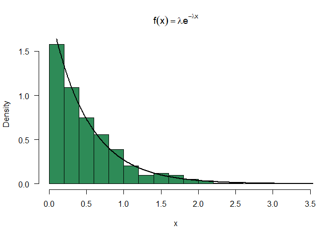

Generating U(a,b) from U(0,1)


```r
U <- function(n, a, b){
  a + (b-a)*runif(n);
}
print(U(10, 2, 6))
```

```
##  [1] 4.114420 3.894277 3.154818 5.080674 4.645040 5.031382 3.133052 5.418136
##  [9] 2.229390 2.701907
```
Simulation checks

```r
a = 4; b = 10;
# prob = T switches y-axis to density
# las = 1 sets the y-axis values vertically
hist(runif(1000, a, b), prob = T, col = "turquoise3", las = 1)
hist(U(1000, a, b), prob = T, col = "green4", las = 1)
```


Inverse transform method

Use the fact that the cdf of $F_x(x)$ is the same as the cdf of $U(0,1)$, i.e 
$F_x(x) \sim U(0,1)$
if $F_x(x)$ is invertible and we can derive the formula analytically, then we 
can generate random variables using

1. Generate $U \sim U(0,1)$
2. Set $X = F^{-1}_x(u)$

More generally, $F^{-1}_x(u) = \inf_x\{F_x(x)=u\}$

Example: Generate exponentially distributed random variables
$X \sim exp(\lambda)$
pdf: $f(x) = \lambda e^{-\lambda x }$ with $x \in (0, \infty)$
A quick calculation shows
cdf: $F_x(x) = 1 - e^{-\lambda x}$
quantile: $F_x^{-1}(x) = -\ln(1-x)/\lambda$

```r
lambda = 2
u = runif(1000)
x = -log(u)/lambda

hist(x, prob = T, las = 1, col="seagreen4",breaks =20,
     main = latex2exp::TeX('$f(x) = \\lambda e^{-\\lambda x }$'))
y = seq(0,4, .01)
lines(y, lambda*exp(-lambda*y), lwd = 2)
```

<!-- -->

$X$ is standard double-exponential distributed i.e
$f(x) = \frac{1}{2}e^{|x|}$
One gets $F_X(x) = \frac{1}{2}e^{x}$ if $x \leq 0$ 

and $F_X(x) = 1-\frac{1}{2}e^{-x}$ if $x>0$

Therefore, $F_X^{-1}(p) = \log(2p)$ if $p\leq 0.5$

and $F_X^{-1}(p) = -\log(2(1-p))$ if $p>0.5$

```r
coolerQ <- function(p){
  return(ifelse(p<=0.5, log(2*p), -log(2*(1-p))))
}
n=10000;
u = runif(n);
x = coolerQ(u);
hist(x, prob = T, las = 1, col="yellow4", breaks = 60,
     main = latex2exp::TeX('$f(x) = \\frac{1}{2}e^{|x|}$'),ylim=c(0,0.5), xlim=c(-6,6))
y = seq(-6,6,.02);
lines(y, 0.5*exp(-abs(y)),lwd = 2, col="red")
d <- density(x);
lines(d, lwd =2, col="green")
```

<!-- -->

Comparison between empirical and theoretical quantiles


```r
p = seq(0.1, 0.9, by = 0.1)
sampleqs = quantile(x,p);
theoryqs = coolerQ(p);
se = sqrt(p*(1-p)/(n*(1/2*exp(-abs(theoryqs)^2))));
devs = round(cbind((sampleqs-theoryqs)/se),2);
df <- data.frame(p,sampleqs,theoryqs,se, devs)
print(df)
```

```
##       p     sampleqs   theoryqs          se  devs
## 10% 0.1 -1.564287873 -1.6094379 0.015492113  2.91
## 20% 0.2 -0.920939026 -0.9162907 0.008607744 -0.54
## 30% 0.3 -0.519628296 -0.5108256 0.007383931 -1.19
## 40% 0.4 -0.220168429 -0.2231436 0.007102857  0.42
## 50% 0.5  0.007895757  0.0000000 0.007071068  1.12
## 60% 0.6  0.230932938  0.2231436 0.007102857  1.10
## 70% 0.7  0.529051879  0.5108256 0.007383931  2.47
## 80% 0.8  0.946768265  0.9162907 0.008607744  3.54
## 90% 0.9  1.658554949  1.6094379 0.015492113  3.17
```


Acceptance-Rejection Method

Example: Generate $X \sim N(0,1)$ using Student t distribution with 2 degrees
of freedom:

$g(x) = \frac{\Gamma(3/2)}{\sqrt{2\pi}}(1+x^2/2)^{-3/2}$

$f(x) = \frac{1}{\sqrt{2\pi}}e^{-x^2/2}$
Find a maximal constant $c$ such that $\frac{f(x)}{g(x)}\leq c$ for all $x$.
After rather long calculation one finds

$c = \frac{(3/2)^{3/2}}{\Gamma(3/2)e^{1/2}} \approx 1.25731677$

The Algorithm:

1. Generate $Y \sim g$
2. Generate $U \sim U(0,1)$
3. if $U \leq \frac{f(Y)}{cg(Y)}$ then accept $Y$ and return, else reject $Y$
and try again.

Notes:
$P(accept) = \frac{1}{c}$

$P(accept|Y=y) = \frac{f(y)}{cg(y)}$

The smaller the $c$, the better is the acceptance rate on average.
If in some regions, the distance between $f$ and $g$ is very big, then the 
acceptance rate there will be very low and thus the sample we generate will most
likely be skewed.

```r
f <- function(x){
  return(1/sqrt(2*pi)*exp(-x^2/2))
}
g <- function(x){
  return(gamma(3/2)/(sqrt(2*pi)*(1+x^2/2)^(3/2)))
}


x = seq(-5, 5, by = 0.02)
plot(x, f(x)/g(x), type = 'l', las =1)

c = (3/2)^(3/2)/(1/2*sqrt(pi)*exp(1/2))
abline(h = c, col ='red')
```

<!-- -->

Plot of $f$ and of the cover density $cg$

```r
plot(x, f(x), type = 'l', las = 1, lwd = 2, col = 'blue', ylim = c(0,0.5), ylab ='y')
lines(x, g(x)*c, type = 'l', lwd = 2, col='green')
legend(1, 0.5, legend=c(latex2exp::TeX('$f(x)$'), latex2exp::TeX('$cg(x)$')),
       col=c("blue","green"), lty=1:2, cex=0.8)
```

<!-- -->

Algorithm to generate $n=1000$ standard normally distributed random variables using 
this approach:


```r
n = 1000;
k = 0;             # number of accepted rvs
niter = 0;         #number of iterations needed
x = numeric(n);    # target samples
while(k<n){
  niter = niter + 1;
  y = rt(n=1,df=2);
  u = runif(1);
  if(u<= f(y)/(c*g(y))){
    k = k+1;
    x[k] = y;
  }
}
print(paste("Number of iterations needed: ", niter));
```

```
## [1] "Number of iterations needed:  1267"
```

```r
print(paste("Expected number of iterations needed: ", n*c));
```

```
## [1] "Expected number of iterations needed:  1257.31676643423"
```

```r
hist(x, prob = T, las = 1, breaks = 20, xlim = c(-4, 4));
y = seq(-4,4, by = 0.02);
lines(y, f(y), lwd = 2)
```

<!-- -->

Empirical versus theoretical quantiles analysis


```r
p = seq(0.1, 0.9, by = 0.1)
theoryqs = qnorm(p)
sampleqs = quantile(x, p)
se = sqrt(p*(1-p)/(n*dnorm(sampleqs)^2))
devs = round(cbind((sampleqs-theoryqs)/se),2);
df <- data.frame(p,sampleqs,theoryqs,se, devs)
print(df)
```

```
##       p    sampleqs   theoryqs         se devs
## 10% 0.1 -1.14046168 -1.2815516 0.04556636 3.10
## 20% 0.2 -0.78232658 -0.8416212 0.04305778 1.38
## 30% 0.3 -0.48615181 -0.5244005 0.04088095 0.94
## 40% 0.4 -0.22353340 -0.2533471 0.03981491 0.75
## 50% 0.5  0.03717566  0.0000000 0.03966067 0.94
## 60% 0.6  0.30205170  0.2533471 0.04064499 1.20
## 70% 0.7  0.60252768  0.5244005 0.04355446 1.79
## 80% 0.8  0.94901909  0.8416212 0.04974172 2.16
## 90% 0.9  1.39203837  1.2815516 0.06266034 1.76
```

```r
plot(p, sampleqs, bg = 'red', pch = 21 , ylim = c(-1.5, 1.5))
points(p, theoryqs, bg = 'green', pch = 21)
legend(0.1, 1, legend=c("generated", "theoretical"),
       col=c("red","green"), pch=c(16,16), bty='n')
```

<!-- -->


Note that the `echo = FALSE` parameter was added to the code chunk to prevent printing of the R code that generated the plot.
