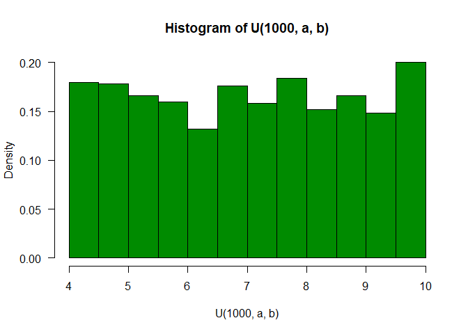

Generating U(a,b) from U(0,1)


```r
U <- function(n, a, b){
  a + (b-a)*runif(n);
}
print(U(10, 2, 6))
```

```
##  [1] 4.020950 5.372851 2.948869 4.643196 5.733455 2.599282 4.196752 2.765975
##  [9] 2.969732 3.631550
```
Simulation checks

```r
a = 4; b = 10;
# prob = T switches y-axis to density
# las = 1 sets the y-axis values vertically
hist(runif(1000, a, b), prob = T, col = "turquoise3", las = 1)
hist(U(1000, a, b), prob = T, col = "green4", las = 1)
```


Inverse transform method

Use the fact that the cdf of $F_x(x)$ is the same as the cdf of $U(0,1)$, i.e 
$F_x(x) \sim U(0,1)$
if $F_x(x)$ is invertible and we can derive the formula analytically, then we 
can generate random variables using

1. Generate $U \sim U(0,1)$
2. Set $X = F^{-1}_x(u)$

More generally, $F^{-1}_x(u) = \inf_x\{F_x(x)=u\}/$

Example: Generate exponentially distributed random variables
$X \sim exp(\lambda)$
pdf: $f(x) = \lambda e^{-\lambda x }$ with $x \in (0, \infty)$
A quick calculation shows
cdf: $F_x(x) = 1 - e^{-\lambda x}$
quantile: $F_x^{-1}(x) = -\ln(1-x)/\lambda$

```r
lambda = 2
u = runif(1000)
x = -log(u)/lambda

hist(x, prob = T, las = 1, col="seagreen4",breaks =20,
     main = latex2exp::TeX('$f(x) = \\lambda e^{-\\lambda x }$'))
y = seq(0,4, .01)
lines(y, lambda*exp(-lambda*y), lwd = 2)
```

<!-- -->

$X$ is standard double-exponential distributed i.e
$f(x) = \frac{1}{2}e^{|x|}$
One gets $F_X(x) = \frac{1}{2}e^{x}$ if $x \leq 0$ 

and $F_X(x) = 1-\frac{1}{2}e^{-x}$ if $x>0$

Therefore, $F_X^{-1}(p) = \log(2p)$ if $p\leq 0.5$

and $F_X^{-1}(p) = -\log(2(1-p))$ if $p>0.5$

```r
coolerQ <- function(p){
  return(ifelse(p<=0.5, log(2*p), -log(2*(1-p))))
}
n=10000;
u = runif(n);
x = coolerQ(u);
hist(x, prob = T, las = 1, col="yellow4", breaks = 60,
     main = latex2exp::TeX('$f(x) = \\frac{1}{2}e^{|x|}$'),ylim=c(0,0.5), xlim=c(-6,6))
y = seq(-6,6,.02);
lines(y, 0.5*exp(-abs(y)),lwd = 2, col="red")
d <- density(x);
lines(d, lwd =2, col="green")
```

<!-- -->

Comparison between empirical and theoretical quantiles


```r
p = seq(0.1, 0.9, by = 0.1)
sampleqs = quantile(x,p);
theoryqs = coolerQ(p);
se = sqrt(p*(1-p)/(n*(1/2*exp(-abs(theoryqs)^2))));
devs = round(cbind((sampleqs-theoryqs)/se),2);
df <- data.frame(p,sampleqs,theoryqs,se, devs)
print(df)
```

```
##       p     sampleqs   theoryqs          se  devs
## 10% 0.1 -1.605331775 -1.6094379 0.015492113  0.27
## 20% 0.2 -0.924998386 -0.9162907 0.008607744 -1.01
## 30% 0.3 -0.501086944 -0.5108256 0.007383931  1.32
## 40% 0.4 -0.215384451 -0.2231436 0.007102857  1.09
## 50% 0.5  0.008168788  0.0000000 0.007071068  1.16
## 60% 0.6  0.233912839  0.2231436 0.007102857  1.52
## 70% 0.7  0.512143111  0.5108256 0.007383931  0.18
## 80% 0.8  0.919143244  0.9162907 0.008607744  0.33
## 90% 0.9  1.637437598  1.6094379 0.015492113  1.81
```


Acceptance-Rejection Method


Note that the `echo = FALSE` parameter was added to the code chunk to prevent printing of the R code that generated the plot.
