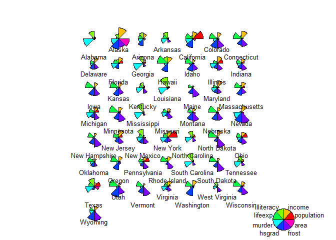

## Exercise 5

Dataset


```r
statedata = as.data.frame(state.x77)
names(statedata)=
c("population","income","illiteracy","lifeexp","murder","hsgrad","frost","area")
attach(statedata)
```

#### 1)

We are interesting in studying the relationship of illiteracy to income, high school graduation rates, life
expectancy and murder rates. Construct four scatterplots, one each for illiteracy versus each of the
other four variables. Use as plotting symbol the abbreviated state names in state.abb. Construct the
appropriate Spearman correlations for each plot. Describe the results in terms of specific units, indicate
by name any unusual outliers, and comment on what the results mean for society.


```r
#par(mfrow = c(2,2))
plot(illiteracy, income, las = 1, bg = "blue", pch="")
text(illiteracy, income, labels = state.abb)
```

<!-- -->

```r
cor(illiteracy, income, method = "spearman")
```

```
## [1] -0.3145948
```

We observe that higher illiteracy rates correlate with less income. Between this 
two there is a weak negative correlation of -0.31. This is to be expected as 
usually better education leads to better salaries. There is however a big outlier
to this, namely Alaska ("AK") where the average income is the highest among all states
even though the illiteracy rate is above average. This might be explained by the 
low population density and the focus on exploitative industries (timber, gold) 
which were very profitable. 
Another outlier is Louisiana ("LA"), with the worst illiteracy rate. This might be
due to the fact that it is a poorer state with fewer educational resources. 


```r
plot(illiteracy, hsgrad, las = 1, bg = "red", pch="")
text(illiteracy, hsgrad, labels = state.abb)
```

<!-- -->

```r
cor(illiteracy, hsgrad, method = "spearman")
```

```
## [1] -0.6545396
```

We observe a significant negative correlation of -0.65 between illiteracy and the percentage
of high-school graduates as going to school is the main solution to illiteracy.
Quite peculiar is the fact that even the states with the biggest percentage of 
high school graduates have a rather small percentage (little above 65%). Perhaps
the data includes children. 


```r
plot(illiteracy, lifeexp, las = 1, bg = "seagreen", pch = "")
text(illiteracy, lifeexp, labels = state.abb)
```

<!-- -->

```r
cor(illiteracy, lifeexp, method = "spearman")
```

```
## [1] -0.5553735
```

Illiteracy and life expectancy are also quite strongly negatively correlated 
with a Spearman correlation of about -0.55. This is not very surprising as education
makes for better lifestyle and awareness for health issues.
One clear outlier is Hawaii ("HI"), with the highest life expectancy, even though 
the illiteracy rate is among the upper quarter. This might be due to low pollution
and the more "close-to-nature" life style.


```r
plot(illiteracy, murder, las = 1, bg = "black", pch = "")
text(illiteracy, murder, labels = state.abb)
```

<!-- -->

```r
cor(illiteracy, murder, method = "spearman")
```

```
## [1] 0.6723592
```
Illiteracy and murder are strongly positively correlated, showing that illiteracy
is associated with crime. One outlier is Nevada ("NV"). The fact that Las Vegas 
is located there might be the cause as the city attracts gamblers and criminal 
activity in general. 

#### 2)
Visualize the attributes of statedata by using the stars command and use it to quickly learn which
state dominate each attribute.


```r
palette(rainbow(8))
stars(statedata, draw.segments = T, nrow = 8, 
      key.loc = c(20,1.5))
```

<!-- -->


#### 3) 
Do what is necessary to get the following code to run and interpret the output.


```r
sta <- cbind(state.abb, statedata, state.region)
colnames(sta)[1] <- "State" # Rename first column
colnames(sta)[10] <- "Region" # Rename the 10th column
sta$region <- tolower(state.name) # Lowercase states' names
states <- map_data("state") # Extract state data
map <- merge(states, sta, by = "region", all.x = T) # Merge states and state.x77 data
map <- map[order(map$order), ] # Must order first
ggplot(map, aes(x = long, y = lat, group = group)) +
geom_polygon(aes(fill = murder), ) +
geom_path() +
scale_fill_gradientn(colours = rev(heat.colors(10))) +
coord_map() +
labs(x = "Longitude", y = "Latitude") +
guides(fill = guide_legend(title = "Murder Rate"))
```

<!-- -->

The code produces a heatmap of murder rate by state. Northern States are more 
peaceful while the Southern states have higher murder rates. 

#### 4)
Run a pca analysis and biplot on the eight attributes of statedata and summarize.


```r
pcUS = prcomp(statedata, center = TRUE, scale = TRUE)
options(digits = 3)
summary(pcUS)
```

```
## Importance of components:
##                         PC1   PC2   PC3    PC4    PC5    PC6    PC7    PC8
## Standard deviation     1.90 1.277 1.054 0.8411 0.6202 0.5545 0.3801 0.3364
## Proportion of Variance 0.45 0.204 0.139 0.0884 0.0481 0.0384 0.0181 0.0141
## Cumulative Proportion  0.45 0.654 0.793 0.8813 0.9294 0.9678 0.9859 1.0000
```

The first three components explain almost 80% of the variability in the data.
Biplot:


```r
biplot(pcUS, pc.biplot = TRUE, las = 1, cex = 0.5, col = c("black", "cyan4"))
```

<!-- -->

The first component is dominated by illiteracy and murder rate (or frost and life
expectancy) and we find Alabama and Lousiana very close to each other. The second
component is dominated by area, population and income. Alaksa has a very big PC2
as it has both the largest area and average income. The other big and populous states,
California, Texas, NY also have a significant second component. 


